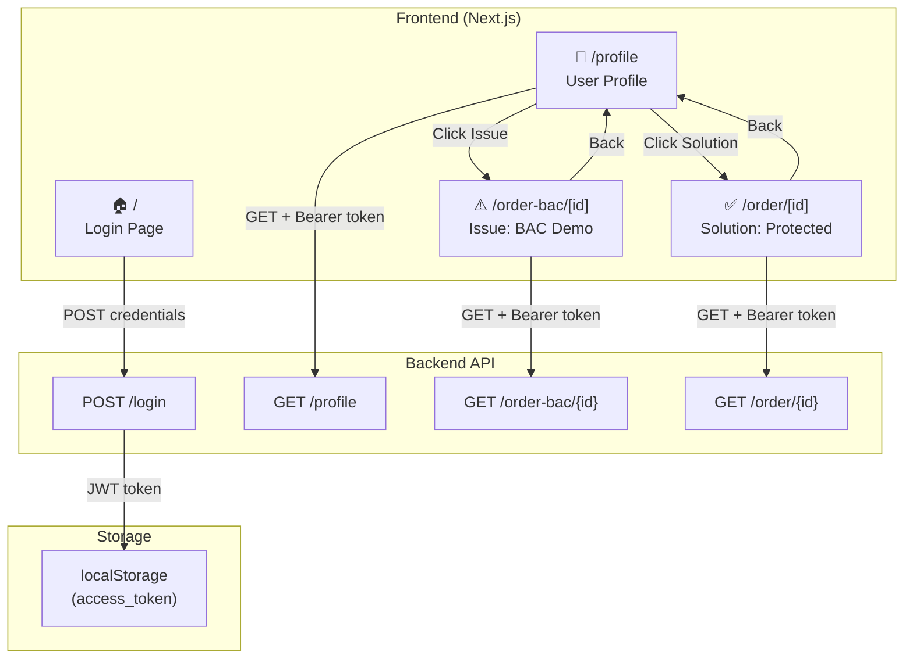

# Flow Charts for Attack Demo App

Tài liệu này mô tả luồng hoạt động và routing của ứng dụng demo tấn công Broken Access Control bằng sơ đồ Mermaid.

**Lưu ý:** GitHub render Mermaid tự động. Trong VS Code, bạn có thể xem preview Markdown hoặc cài extension "Markdown Preview Mermaid Support".

## Sơ đồ tổng quan ứng dụng



## Luồng đăng nhập (HomePage - /)

```mermaid
flowchart TD
    Start([👤 Người dùng nhập form]) --> Load[🔄 setLoading(true)<br/>setStatus(null)]
    Load --> API[📡 POST /login<br/>{username, password}]
    
    API --> Response{📥 Phản hồi từ API}
    Response -->|❌ !response.ok| Error[⚠️ Xử lý lỗi]
    Response -->|✅ response.ok| ParseToken[🔍 Kiểm tra access_token]
    
    Error --> ErrorMsg[📝 Hiển thị thông báo lỗi<br/>setStatus({type: 'error'})]
    ErrorMsg --> StopLoading[⏹️ setLoading(false)]
    
    ParseToken -->|❌ Không có token| NoToken[⚠️ Lỗi: Không có access_token]
    ParseToken -->|✅ Có token hợp lệ| SaveToken[💾 localStorage.setItem<br/>('access_token', token)]
    
    NoToken --> ErrorMsg
    SaveToken --> Success[✅ setStatus({type: 'success'<br/>'Redirecting...'})]
    Success --> Navigate[🔄 router.push('/profile')]
    Navigate --> StopLoading
```

## Luồng trang Profile (/profile)

```mermaid
flowchart TD
    Mount([🏁 ProfilePage mount]) --> CheckToken[🔍 Kiểm tra access_token<br/>từ localStorage]
    
    CheckToken -->|❌ Không có token| RedirectLogin[🔄 router.replace('/')<br/>Chuyển về trang login]
    CheckToken -->|✅ Có token| APICall[📡 GET /profile<br/>với Bearer token]
    
    APICall --> CheckAuth{🔐 Kiểm tra xác thực}
    CheckAuth -->|401 Unauthorized| ClearToken[🗑️ Xóa token khỏi localStorage] 
    ClearToken --> RedirectLogin
    
    CheckAuth -->|✅ Xác thực thành công| ParseProfile[🔍 Parse dữ liệu profile<br/>Extract: restaurant_id, restaurant_name, user_name]
    CheckAuth -->|❌ Lỗi khác| ShowError[⚠️ Hiển thị lỗi]
    
    ParseProfile --> SetState[💾 setProfile(data)<br/>setRestaurantId(id)]
    SetState --> RenderUI[🖼️ Render giao diện profile]
    
    RenderUI --> UserAction{👆 Người dùng click}
    UserAction -->|Issue Button| GoIssue[🚀 router.push<br/>('/order-bac/{restaurantId}')<br/>Demo lỗ hổng BAC]
    UserAction -->|Solution Button| GoSolution[🚀 router.push<br/>('/order/{restaurantId}')<br/>Phiên bản đã fix]
```

## Trang Order-bac (⚠️ Issue: Broken Access Control)

```mermaid
flowchart TD
    Mount([🏁 OrderDetailPage mount]) --> CheckToken[🔍 Kiểm tra token]
    
    CheckToken -->|❌ Không có token| RedirectLogin[🔄 router.replace('/')] 
    CheckToken -->|✅ Có token| CheckId{🆔 URL có ID?}
    
    CheckId -->|❌ Không có ID| ErrorNoId[⚠️ setError<br/>'Unable to determine restaurant id']
    CheckId -->|✅ Có ID| APICall[📡 GET /order-bac/{id}<br/>⚠️ KHÔNG kiểm tra quyền truy cập]
    
    APICall --> AuthCheck{🔐 Kiểm tra response}
    AuthCheck -->|401| ClearToken[🗑️ Xóa token] --> RedirectLogin
    AuthCheck -->|200 OK| ParseData[📋 Parse dữ liệu đơn hàng<br/>⚠️ Có thể xem data của nhà hàng khác!]
    AuthCheck -->|Error khác| ShowError[⚠️ Hiển thị lỗi]
    
    ParseData --> SetData[💾 setOrderData(response)]
    SetData --> RenderTable[🖼️ Render bảng đơn hàng<br/>STT | Mã hàng | Số lượng | Ngày tạo]
    
    RenderTable --> BackButton[🔙 Back to Profile button]
    BackButton --> GoBack[router.push('/profile')]
    
    style APICall fill:#ffcccc
    style ParseData fill:#ffcccc
```

## Trang Order (✅ Solution: Enforced Access Control)

```mermaid
flowchart TD
    Mount([🏁 OrderSolutionPage mount]) --> CheckToken[🔍 Kiểm tra token]
    
    CheckToken -->|❌ Không có token| RedirectLogin[🔄 router.replace('/')]
    CheckToken -->|✅ Có token| CheckId{🆔 URL có ID?}
    
    CheckId -->|❌ Không có ID| ErrorNoId[⚠️ setError<br/>'Missing restaurant id in URL']
    CheckId -->|✅ Có ID| APICall[📡 GET /order/{id}<br/>✅ Có kiểm tra quyền truy cập]
    
    APICall --> AuthCheck{🔐 Kiểm tra response}
    AuthCheck -->|401 Unauthorized| ClearToken[🗑️ Xóa token] --> RedirectLogin
    AuthCheck -->|403 Forbidden| Show403[🚫 setError<br/>'Bạn không có quyền truy cập'<br/>✅ Chặn truy cập không hợp lệ]
    AuthCheck -->|200 OK| ParseData[📋 Parse dữ liệu đơn hàng<br/>✅ Chỉ xem được data của nhà hàng mình]
    AuthCheck -->|Error khác| ShowError[⚠️ Hiển thị lỗi khác]
    
    ParseData --> SetOrders[💾 setOrders(response)]
    SetOrders --> RenderTable[🖼️ Render bảng đơn hàng<br/>STT | Mã hàng | Số lượng | Ngày tạo]
    
    RenderTable --> BackButton[🔙 Back to Profile button]
    BackButton --> GoBack[router.push('/profile')]
    
    style Show403 fill:#ccffcc
    style ParseData fill:#ccffcc
    style APICall fill:#ccffcc
```

## Logic xử lý và render dữ liệu Order

```mermaid
flowchart TD
    Start([📥 OrderResponse từ API]) --> CheckType{🔍 Kiểm tra kiểu dữ liệu}
    
    CheckType -->|Array| DirectArray[📋 Mảng đơn hàng trực tiếp]
    CheckType -->|Object| CheckObject{🔍 Object có 'orders'?}
    CheckType -->|Other| FormatOther[📝 formatValue() để hiển thị]
    
    DirectArray --> RenderArrayTable[🖼️ Render bảng từ mảng<br/>STT | Mã hàng | Số lượng | Ngày tạo]
    
    CheckObject -->|✅ Có 'orders'| ExtractData[📊 Extract:<br/>• count (số lượng)<br/>• restaurant_name<br/>• orders (mảng)]
    CheckObject -->|❌ Không có 'orders'| ShowEmpty[📝 'Không có đơn hàng nào'<br/>+ hiển thị fields khác]
    
    ExtractData --> ShowMeta[📋 Hiển thị metadata:<br/>• Tổng số: {count}<br/>• Nhà hàng: {restaurant_name}]
    ShowMeta --> CheckOrderArray{📋 Có orders array?}
    
    CheckOrderArray -->|✅ Có data| RenderObjectTable[🖼️ Render bảng orders<br/>STT | Mã hàng | Số lượng | Ngày tạo]
    CheckOrderArray -->|❌ Empty| ShowNoOrders[📝 'No orders were returned']
    
    RenderArrayTable --> BackButton[🔙 Back to Profile]
    RenderObjectTable --> BackButton
    ShowNoOrders --> BackButton
    ShowEmpty --> BackButton
    FormatOther --> BackButton

## So sánh Issue vs Solution

```mermaid
graph TB
    subgraph "⚠️ Issue: /order-bac/[id] (Broken Access Control)"
        IssueAPI["📡 GET /order-bac/{id}"]
        IssueResponse["✅ Trả về data bất kỳ restaurant nào<br/>🚨 KHÔNG kiểm tra quyền sở hữu"]
        IssueRisk["🚨 Rủi ro: Xem được data của competitor"]
    end
    
    subgraph "✅ Solution: /order/[id] (Proper Access Control)"
        SolutionAPI["📡 GET /order/{id}"]
        SolutionCheck["🔐 Kiểm tra quyền truy cập"]
        SolutionForbidden["🚫 HTTP 403 nếu không có quyền"]
        SolutionResponse["✅ Chỉ trả về data của restaurant mình"]
    end
    
    User([👤 Người dùng]) --> IssueAPI
    User --> SolutionAPI
    
    IssueAPI --> IssueResponse --> IssueRisk
    SolutionAPI --> SolutionCheck
    SolutionCheck -->|Có quyền| SolutionResponse  
    SolutionCheck -->|Không có quyền| SolutionForbidden
    
    style IssueResponse fill:#ffcccc
    style IssueRisk fill:#ff9999
    style SolutionCheck fill:#ccffcc
    style SolutionResponse fill:#ccffcc
```
